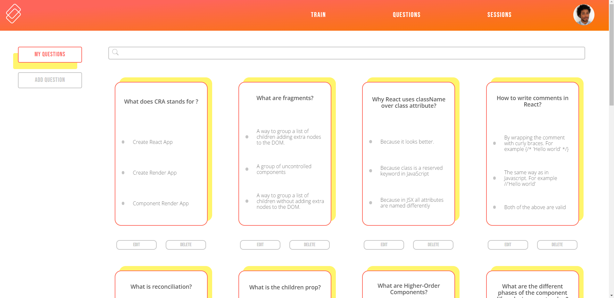
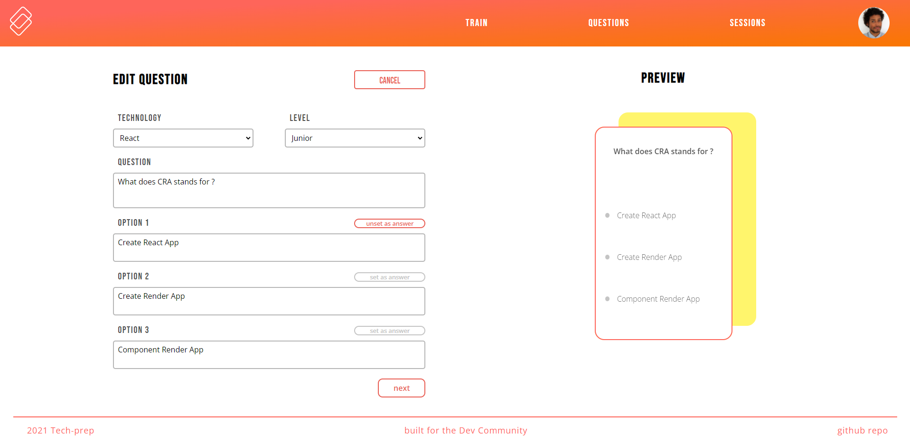
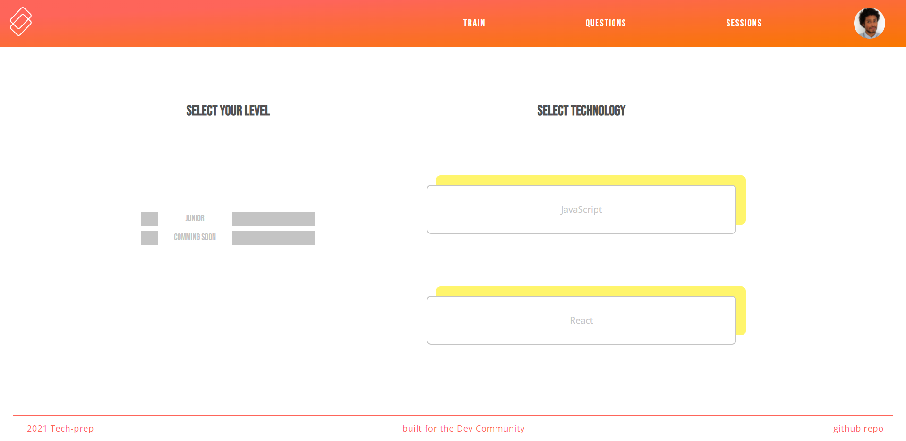
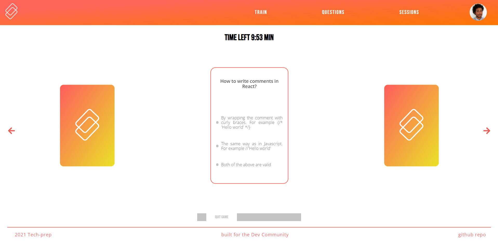
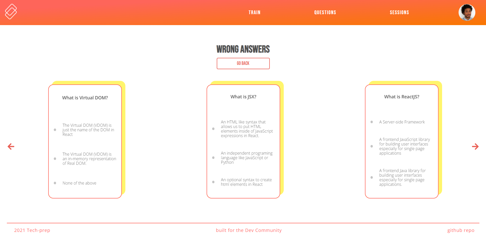

# Tech-Prep

This is the personal project developed during two weeks in the make it real bootcamp.
Tech-prep is my way to contribute something to the community, it is a project to train technical concepts to become better developers.
If you want to contribute to this educational tool please feel free to fork the repo and do some commits.

## The project:

The project consists of a card game where you will see multiple choice questions and test your technical knowledge. As more users create more questions the game will grow in topics and difficulty levels.
At the moment there is no Admin page, that is the next step, so for the time being, take seriously the questions you are going to create so we can all grow together.
(As I write this readme I realize that I should probably have an instruction page in the web application, so this will be my first task after the public demo.)
For the backend go here [https://github.com/Cesar-M-Diaz/Tech-Prep-Back](https://github.com/Cesar-M-Diaz/Tech-Prep-Back)

### `Add edit or delete questions`

As a user you can create your own questions, manage them from the questions bar and delete them if you wish.

`Create a question card`

`View your question cards`

`Edit a question`

### `play the game`

At the moment there is only the junior level, the questions will be about basic JavaScript or React concepts. Feel free to add more levels and questions.

`Select the level`

`Play the game`

### `review your training sessions`

At the end of each game you will be presented with the wrong answers, in the session section you can see the history of the previous games.

`review your session result`

